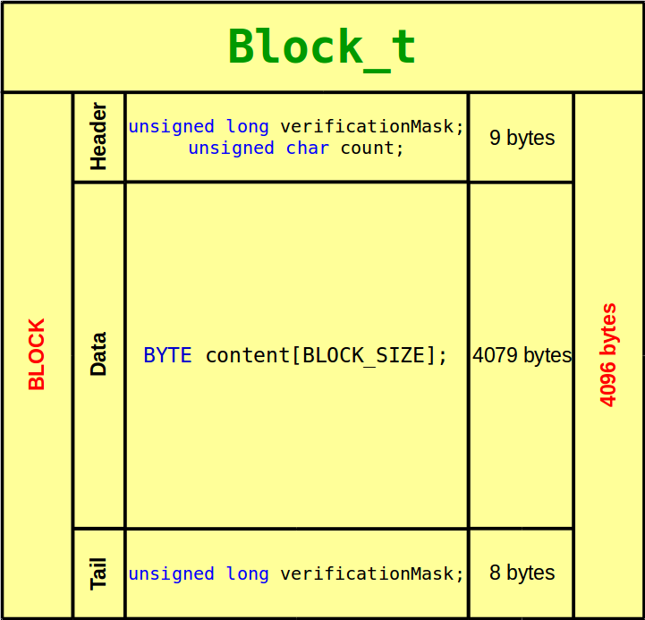
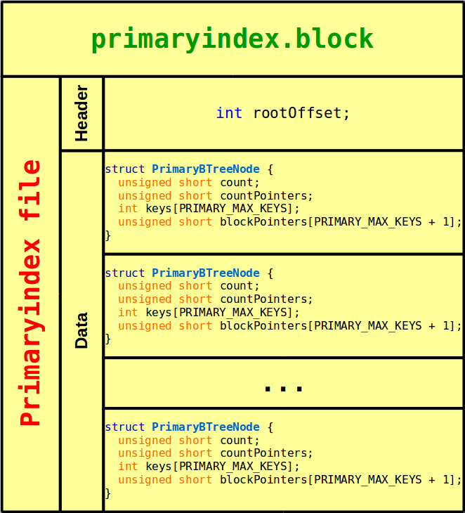

## Documentação do Trabalho Prático 1

---
<p align ="right"> 03/09/2017 </p>

#### Alunos 
  
  - **Ruan Gabriel Gato Barros** - 21553690
  - **Rúben Jozafá Silva Belém** - 21551560

---

Esse trabalho teve como objetivo a implementação de programas para armazenamento e pesquisa de dados indexados partindo de uma massa de dados.

---

### 1. Estrutura do Projeto

#### A leitura do arquivo `artigo.csv` *(parsing)*

O arquivo `artigo.csv` foi lido de forma que fosse possível classificar cada par de caracteres, de forma que seja possível ler o arquivo de forma muito mais rápida que um `regex`, por exemplo; então,decidimos classificar cada par de caracteres na leitura para fazer o parsing dos registros, salvando-os num buffer para tratar os caracteres excedentes e especiais.


#### O arquivo de dados organizado por hashing

Optamos por implementar o `hash perfeito`, tendo em mente várias simplicidades que tal implementação traria. Embora tal implementação fosse bastante custosa no que diz respeito à memória secundária, não teve um impacto negativo suficientemente grande para superar os benefícios de tal organização.

A implementação do bloco levou em consideração que os artigos possuem um tamanho suficientemente grande para não ser possível o armazenamento de mais de um artigo por bloco, levando em consideração que a implementação escolhida foi de dados não espalhados.

No que diz respeito à validade do bloco `-` já que foi utilizado um hash perfeito, então muitos blocos inválidos naturalmente se encontrarão no arquivo `-` utilizamos uma técnica muito utilizada em sistemas operacionais para indicar que aquela região de memória é o início de um campo válido, forçando a verificação do bloco com uma máscara grande o suficiente para ser praticamente impossível se igualar com lixo de memória.



A estrutura do bloco, como vista acima, conta com 3 subdivisões : 

1 . **Header** - responsável por armazenar a máscara de verificação e a contagem de artigos, tendo essa divisão um tamanho total de 9 bytes em uma arquitetura `x64`.

2 . **Data** - responsável por armazenar os artigos (no caso, artigo; mas foi implementada de forma que seja facilmente adaptado para mais artigos).

3 . **Tail** - responsável por armazenar a segunda parte da máscara de verificação e contagem de artigos, sendo tal divisão sendo um nível a mais de segurança na integridade dos arquivos.


#### O arquivo de índice primário

Optamos por indexar o `id` utilizando o mínimo de espaço possível. A organização por hash no arquivo nos permitiu economizar o espaço de ponteiro para dados, já que **a chave de busca é o próprio ponteiro para dados**. Verificamos que, para cada nó da árvore que comporta 680 elementos, seria possível representar os ponteiros para blocos com uma variável do tipo `unsigned short`.

A implementação da indexação primária levou em consideração a utilização de um header para indicar o nó raíz, além de indexar os blocos de índice propriamente ditos por meio da struct abaixo : 

```
struct PrimaryBTreeNode {
  unsigned short count;
  unsigned short countPointers;
  int keys[PRIMARY_MAX_KEYS];Título [TROCAR]
  unsigned short blockPointers[PRIMARY_MAX_KEYS + 1];

  PrimaryBTreeNode(int order);
  bool isLeaf();
  bool hasRoom();
  unsigned short insert(int key);
};
```

A estrutura do arquivo pode ser averiguada abaixo : 



#### O arquivo de índice secundário

O arquivo de índice secundário se assemelha bastante com o arquivo de índice primário, possuindo este um header para indicar o offset do nó raíz. A principal diferença está no fato de que a chave de busca não é mais o ponteiro para dados, já que a chave de busca se trata de um `char[300]`, diferente do ponteiro para dados. 

Um detalhe importante dessa implementação é que, devido ao enorme tamanho da chave de busca, só foi possível armazenar poucos elementos por nó, consequentemente existirão mais nós para serem representados, sugerindo uma mudança no tamanho da variável que armazena o ponteiro para blocos, sendo essa no índice primário um `unsigned short` e no índice secundário um `int`, justamente para comportar o número gigantesco de blocos.

---

### 2. Dependência de Fontes

---

### 3. Funções das Fontes

---

### 4. Quem desenvolveu cada fonte/função

---


# Rascunho
```seek1```<br>
```seek2```<br>
```findrec```<br>
```upload```<br>
```./files/```
<br>&nbsp;&nbsp;&nbsp;&nbsp;&nbsp;&nbsp;&nbsp;&nbsp;&nbsp;&nbsp;&nbsp;&nbsp;&nbsp;&nbsp;&nbsp;&nbsp;&nbsp;
```primaryindex.block```
<br>&nbsp;&nbsp;&nbsp;&nbsp;&nbsp;&nbsp;&nbsp;&nbsp;&nbsp;&nbsp;&nbsp;&nbsp;&nbsp;&nbsp;&nbsp;&nbsp;&nbsp;
```secondaryindex.block```
<br>&nbsp;&nbsp;&nbsp;&nbsp;&nbsp;&nbsp;&nbsp;&nbsp;&nbsp;&nbsp;&nbsp;&nbsp;&nbsp;&nbsp;&nbsp;&nbsp;&nbsp;
```data.block```

- Decidimos classificar cada par de caracteres na leitura para fazer o parsing dos registros, salvando-os num buffer para tratar os caracteres excedentes.
- Decidimos usar hash perfeito, nos custou memória.
  - Optamos por utilizar máscaras de validação ao invés de bitmap de pertinência, uma vez que é custoso para muitos elementos (visto que é um hash perfeito)

- Árvore de Dependências
```
Projeto
│
├───▶ upload
│     |
│     └─▶ hashfilefactory
│         │
│         ├─▶ iohandler
│         │   │
│         │   └─▶ article
│         │
│         └─▶ block
│             │
│             └─▶ article
│
├───▶ findrec
│     |
│     └─▶ hashfilefactory
│         │
│         ├─▶ iohandler
│         │   │
│         │   └─▶ article
│         │
│         └─▶ block
│             │
│             └─▶ article
│
├───▶ seek1
│     
│     
│     
│     
│     
│     
└───▶ seek2
```
