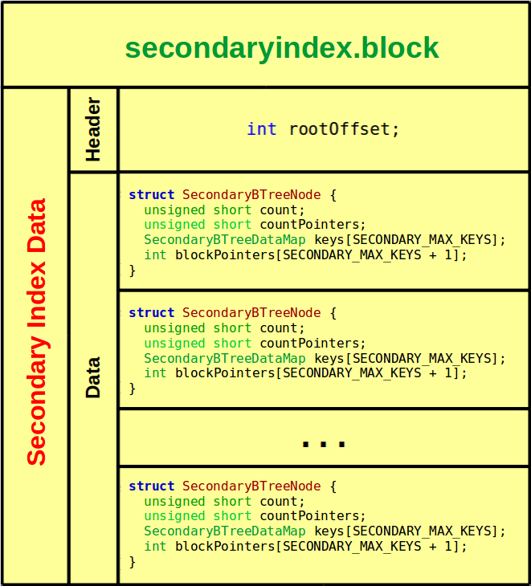

## Documentação do Trabalho Prático 1

---
<p align ="right"> 03/09/2017 </p>

#### Alunos 
  
  - **Ruan Gabriel Gato Barros** - 21553690
  - **Rúben Jozafá Silva Belém** - 21551560

---

Esse trabalho teve como objetivo a implementação de programas para armazenamento e pesquisa de dados indexados partindo de uma massa de dados.

---

### 1. Estrutura do Projeto

#### A leitura do arquivo `artigo.csv` *(parsing)*

O arquivo `artigo.csv` foi lido de forma que fosse possível classificar cada par de caracteres, de forma que seja possível ler o arquivo de forma muito mais rápida que um `regex`, por exemplo; então,decidimos classificar cada par de caracteres na leitura para fazer o parsing dos registros, salvando-os num buffer para tratar os caracteres excedentes e especiais.


#### O arquivo de dados organizado por hashing

Optamos por implementar o `hash perfeito`, tendo em mente várias simplicidades que tal implementação traria. Embora tal implementação fosse bastante custosa no que diz respeito à memória secundária, não teve um impacto negativo suficientemente grande para superar os benefícios de tal organização.

A implementação do bloco levou em consideração que os artigos possuem um tamanho suficientemente grande para não ser possível o armazenamento de mais de um artigo por bloco, levando em consideração que a implementação escolhida foi de dados não espalhados.

No que diz respeito à validade do bloco `-` já que foi utilizado um hash perfeito, então muitos blocos inválidos naturalmente se encontrarão no arquivo `-` utilizamos uma técnica muito utilizada em sistemas operacionais para indicar que aquela região de memória é o início de um campo válido, forçando a verificação do bloco com uma máscara grande o suficiente para ser praticamente impossível se igualar com lixo de memória.


A estrutura do bloco, como vista acima, conta com 3 subdivisões : 

1 . **Header** - responsável por armazenar a máscara de verificação e a contagem de artigos, tendo essa divisão um tamanho total de 9 bytes em uma arquitetura `x64`.

2 . **Data** - responsável por armazenar os artigos (no caso, artigo; mas foi implementada de forma que seja facilmente adaptado para mais artigos).

3 . **Tail** - responsável por armazenar a segunda parte da máscara de verificação e contagem de artigos, sendo tal divisão sendo um nível a mais de segurança na integridade dos arquivos.


#### O arquivo de índice primário

Optamos por indexar o `id` utilizando o mínimo de espaço possível. A organização por **hash perfeito** no arquivo nos permitiu economizar o espaço de ponteiro para dados, já que **a chave de busca é o próprio ponteiro para dados**. Verificamos que, para cada nó da árvore que comporta 680 elementos, seria possível representar os ponteiros para blocos com uma variável do tipo `unsigned short`.

A implementação da indexação primária levou em consideração a utilização de um header para indicar o nó raíz, além de indexar os blocos de índice propriamente ditos por meio da struct abaixo : 

```
struct PrimaryBTreeNode {
  unsigned short count;
  unsigned short countPointers;
  int keys[PRIMARY_MAX_KEYS];Título [TROCAR]
  unsigned short blockPointers[PRIMARY_MAX_KEYS + 1];

  PrimaryBTreeNode(int order);
  bool isLeaf();
  bool hasRoom();
  unsigned short insert(int key);
};
```

A estrutura do arquivo pode ser averiguada abaixo : 


#### O arquivo de índice secundário

O arquivo de índice secundário se assemelha bastante com o arquivo de índice primário, possuindo este um header para indicar o offset do nó raíz. A principal diferença está no fato de que a chave de busca não é mais o ponteiro para dados, já que a chave de busca se trata de um `char[300]`, diferente do ponteiro para dados. 

Um detalhe importante dessa implementação é que, devido ao enorme tamanho da chave de busca, só foi possível armazenar poucos elementos por nó, consequentemente existirão mais nós para serem representados, sugerindo uma mudança no tamanho da variável que armazena o ponteiro para blocos, sendo essa no índice primário um `unsigned short` e no índice secundário um `int`, justamente para comportar o número gigantesco de blocos.

A indexação conta com duas estruturas principais utilizadas para representar um nó : 

```
struct SecondaryBTreeNode {
  unsigned short count;
  unsigned short countPointers;
  SecondaryBTreeDataMap keys[SECONDARY_MAX_KEYS];por char[SECONDARY_KEY_LENGTH] para o Título [TROCAR]
  int blockPointers[SECONDARY_MAX_KEYS + 1];

  SecondaryBTreeNode(int order);
  bool isLeaf();
  bool hasRoom();
  int insert(SecondaryBTreeDataMap&);
};

```

```
struct SecondaryBTreeDataMap {
  char key[SECONDARY_KEY_LENGTH];
  int dataPointer;

  bool operator< (const SecondaryBTreeDataMap& other) const;
  bool operator> (const SecondaryBTreeDataMap& other) const;
  bool operator==(const SecondaryBTreeDataMap& other) const;
  void operator=(const SecondaryBTreeDataMap& other);
};
```

Tais structs representam um bloco e seus devidos campos, abaixo é possível averiguar a estrutura do nó em um bloco abaixo : 



---

### 2. Dependência de Fontes

Para uma visualização realmente completa de todas as dependências de cada um dos 4 arquivos-fonte dos programas principais, nós decidimos representá-las no formato de árvore de dependências presente abaixo. Há algumas redundâncias, mas porque procuramos representar da forma mais fiel possível ao que está presente nos arquivos *header*.

- Árvore de Dependências
```
Projeto
│
├───▶️ upload
│     │
│     └─▶️ hashfilefactory
│         │
│         ├─▶️ iohandler
│         │   │
│         │   └─▶️ article
│         │
│         └─▶️ block
│         │   │
│         │   └─▶️ article
│         │   │
│         │   └─▶️ typessize
│         │
│         └─▶️ primarybtree
│         │   │
│         │   └─▶️ arrayoperations
│         │   │
│         │   └─▶️ block
│         │   │   │
│         │   │   └─▶️ article
│         │   │   │
│         │   │   └─▶️ typessize
│         │   │
│         │   └─▶️ hashfinder
│         │       │
│         │       └─▶️ article
│         │       │
│         │       └─▶️ block
│         │           │
│         │           └─▶️ article
│         │           │
│         │           └─▶️ typessize
│         │
│         └─▶️ secondarybtree
│             │
│             └─▶️ arrayoperations
│             │
│             └─▶️ block
│             │   │
│             │   └─▶️ article
│             │   │
│             │   └─▶️ typessize
│             │
│             └─▶️ hashfinder
│                 │
│                 └─▶️ article
│                 │
│                 └─▶️ block
│                     │
│                     └─▶️ article
│                     │
│                     └─▶️ typessize
│
├───▶️ findrec
│     │
│     └─▶️ hashfinder
│         │
│         └─▶️ article
│         │
│         └─▶️ block
│             │
│             └─▶️ article
│             │
│             └─▶️ typessize
│
├───▶️ seek1
│     │
│     └─▶️ article
│     │
│     └─▶️ primarybtree
│         │
│         └─▶️ arrayoperations
│         │
│         └─▶️ block
│         │   │
│         │   └─▶️ article
│         │   │
│         │   └─▶️ typessize
│         │
│         └─▶️ hashfinder
│             │
│             └─▶️ article
│             │
│             └─▶️ block
│                 │
│                 └─▶️ article
│                 │
│                 └─▶️ typessize
│     
│     
│     
│     
│     
│     
└───▶️ seek2
      │
      └─▶️ article
      │
      └─▶️ secondarybtree
          │
          └─▶️ arrayoperations
          │
          └─▶️ block
          │   │
          │   └─▶️ article
          │   │          
          │   └─▶️ typessize
          │
          └─▶️ hashfinder
              │
              └─▶️ article
              │              
              └─▶️ block
                  │
                  └─▶️ article
                  │
                  └─▶️ typessize
```


---

### 3. Execução

#### Documentação

Foi utilizada a ferramenta `doxygen` para a documentação do código fonte, sendo tal software necessário se desejar gerar a documentação. Além disso, foi utilizada a ferramenta auxiliar `moxygen` para converter os formatos gerados do `doxygen` para `markdown`.

**`tl;dr`** :  foram utilizadas as ferramentas `doxygen` e `moxygen`.

#### Compilação

Para a compilação, basta executar o comando `make` na pasta raiz do projeto, serão gerados quatro executáveis : `upload`,`findrec`,`seek1` e `seek1`.

#### Execução

Os arquivos possuem duas maneiras de entrada (exceto o arquivo `upload`), recebem parâmetros ou da entrada `char *argv[]` ou da própria stream de entrada `cin`, eis alguns exemplos : 

```
[Via ARGV]

./seek1 123
```

```
[Via CIN]
./seek1

> 123

```


```
[Via ARGV]
(pelo argv, deve ser executado passando a string desejada entre aspas)

./seek2 "ICAN : efficiently calculate active node set from searches"

```


```
[Via CIN]
./seek2

> ICAN : efficiently calculate active node set from searches

```

---

---

---

#### Documentação do Código

# class `HashFileFactory` 

A class to recover raw information in the hashed file

## Summary

 Members                        | Descriptions                                | Author
--------------------------------|---------------------------------------------|---------------------------------------------
`public void `[`createBinaryFilePerfectHash`](#classHashFileFactory_1af64194105d574ff29ae3c42a692a6577)`(FILE * toRead,FILE * toWrite)` | Create the hashed file using the file on the first paramether to read the CSV format file and the file on the second paramether to write the binary file as a bonus, create the primary index as well xD | `Rúben Belém` 

## Members

#### `public void `[`createBinaryFilePerfectHash`](#classHashFileFactory_1af64194105d574ff29ae3c42a692a6577)`(FILE * toRead,FILE * toWrite)` 

Create the hashed file using the file on the first paramether to read the CSV format file and the file on the second paramether to write the binary file as a bonus, create the primary index as well xD

# class `IOHandler` 

A class to read and handle the CSV file, buffering and handleing the fields

## Summary

 Members                        | Descriptions                                | Author
--------------------------------|---------------------------------------------|---------------------------------------------
`public  `[`IOHandler`](#classIOHandler_1a6f8dc5e7c219e3c8c41e9590d88d8980)`(FILE *)` | Default [IOHandler](#classIOHandler) constructor, receiving a file to read
`public bool `[`hasNext`](#classIOHandler_1af8bee2b8cc00394e3d0879eca488b66f)`()` | Verify if there is next record in the buffer | `Ruan Gabriel`
`public void `[`parseNext`](#classIOHandler_1a2dd83f5ba06daa0566808153c3fc87b8)`()` | Prepare the next parsing element | `Ruan Gabriel`
`public void `[`operator>>`](#classIOHandler_1a550ed8aba7144814c4438691a6f3c051)`(`[`Article_t`](#structArticle__t)` &)` | Copy the content of the buffer into an article | `Ruan Gabriel`
`public int `[`getBiggestId`](#classIOHandler_1a5383c31a191a91c4697024a73904b459)`()` | Parse the next record contained in the buffer | `Ruan Gabriel`

## Members

#### `public  `[`IOHandler`](#classIOHandler_1a6f8dc5e7c219e3c8c41e9590d88d8980)`(FILE *)` 

Default [IOHandler](#classIOHandler) constructor, receiving a file to read

#### `public bool `[`hasNext`](#classIOHandler_1af8bee2b8cc00394e3d0879eca488b66f)`()` 

Verify if there is next record in the buffer

#### `public void `[`parseNext`](#classIOHandler_1a2dd83f5ba06daa0566808153c3fc87b8)`()` 

Prepare the next parsing element

#### `public void `[`operator>>`](#classIOHandler_1a550ed8aba7144814c4438691a6f3c051)`(`[`Article_t`](#structArticle__t)` &)` 

Copy the content of the buffer into an article

#### `public int `[`getBiggestId`](#classIOHandler_1a5383c31a191a91c4697024a73904b459)`()` 

Parse the next record contained in the buffer

# class `PrimaryBTree` 

A class abstracting the btree

## Summary

 Members                        | Descriptions                                | Author
--------------------------------|---------------------------------------------|---------------------------------------------
`public unsigned short `[`rootOffset`](#classPrimaryBTree_1a34bf3c19a0553c194431994a0fe9d3c9) | 
`public void `[`insert`](#classPrimaryBTree_1aa730e6f8d8e62375ea120a71604f8a90)`(int key,FILE * indexFile)` | Insert a key in the tree | `Rúben Belém`/`Ruan Gabriel`
`public std::pair< bool, int > `[`getArticle`](#classPrimaryBTree_1afc29d73665c9df8b3bb1d5bea2d7292c)`(int key,`[`Article_t`](#structArticle__t)` *,FILE *)` | Get an article from the tree | `Rúben Belém`/`Ruan Gabriel`
`public void `[`buildIndex`](#classPrimaryBTree_1aaf3279355fa7a3818bb453d7bd0e3fc6)`(FILE *)` | Build the [PrimaryBTree](#classPrimaryBTree) index, writing a new root and its offset | `Rúben Belém`
`public void `[`readRoot`](#classPrimaryBTree_1ae1388a6ddbe57a1437c31a5429445b12)`(FILE * indexFile)` | Read the root whence the offset is set | `Rúben Belém`
`public  `[`PrimaryBTree`](#classPrimaryBTree_1a6479ac0c1a7dafea15b47540f8823581)`()` | [PrimaryBTree](#classPrimaryBTree) constructor |

## Members

#### `public unsigned short `[`rootOffset`](#classPrimaryBTree_1a34bf3c19a0553c194431994a0fe9d3c9) 

#### `public void `[`insert`](#classPrimaryBTree_1aa730e6f8d8e62375ea120a71604f8a90)`(int key,FILE * indexFile)` 

Insert a key in the tree

#### `public std::pair< bool, int > `[`getArticle`](#classPrimaryBTree_1afc29d73665c9df8b3bb1d5bea2d7292c)`(int key,`[`Article_t`](#structArticle__t)` *,FILE *)` 

Get an article from the tree

#### `public void `[`buildIndex`](#classPrimaryBTree_1aaf3279355fa7a3818bb453d7bd0e3fc6)`(FILE *)` 

Build the [PrimaryBTree](#classPrimaryBTree) index, writing a new root and its offset

#### `public void `[`readRoot`](#classPrimaryBTree_1ae1388a6ddbe57a1437c31a5429445b12)`(FILE * indexFile)` 

Read the root whence the offset is set

#### `public  `[`PrimaryBTree`](#classPrimaryBTree_1a6479ac0c1a7dafea15b47540f8823581)`()` 

[PrimaryBTree](#classPrimaryBTree) constructor

# class `SecondaryBTree` 

A class abstracting the btree

## Summary

 Members                        | Descriptions                                | Author
--------------------------------|---------------------------------------------|--------------------------------
`public int `[`rootOffset`](#classSecondaryBTree_1ac18f4a43f67189cefc3181549cb02920) | 
`public void `[`insert`](#classSecondaryBTree_1a8c28fdfad8ed08d089ea5a844680727b)`(`[`SecondaryBTreeDataMap`](#structSecondaryBTreeDataMap)` &,FILE * indexFile)` | Insert a key in the tree | `Rúben Belém`/`Ruan Gabriel`
`public std::pair< bool, int > `[`getArticle`](#classSecondaryBTree_1a306602256c122f9dd0349a7c4d6cf06a)`(`[`SecondaryBTreeDataMap`](#structSecondaryBTreeDataMap)` & key,`[`Article_t`](#structArticle__t)` *,FILE *)` | Get an article from the tree | `Ruan Gabriel`
`public void `[`buildIndex`](#classSecondaryBTree_1a171cb2a90b7f5b125be7d46e634dc4f6)`(FILE *)` | Build the [PrimaryBTree](#classPrimaryBTree) index, writing a new root and its offset | `Rúben Belém`
`public void `[`readRoot`](#classSecondaryBTree_1af6c413fc1b6f4b164b567ec8ed99a7e7)`(FILE * indexFile)` | Read the root whence the offset is set | `Rúben Belém`
`public  `[`SecondaryBTree`](#classSecondaryBTree_1a0d51148b5ca1adc98902b30e3b4a14b6)`()` | [PrimaryBTree](#classPrimaryBTree) constructor |

## Members

#### `public int `[`rootOffset`](#classSecondaryBTree_1ac18f4a43f67189cefc3181549cb02920) 

#### `public void `[`insert`](#classSecondaryBTree_1a8c28fdfad8ed08d089ea5a844680727b)`(`[`SecondaryBTreeDataMap`](#structSecondaryBTreeDataMap)` &,FILE * indexFile)` 

Insert a key in the tree

#### `public std::pair< bool, int > `[`getArticle`](#classSecondaryBTree_1a306602256c122f9dd0349a7c4d6cf06a)`(`[`SecondaryBTreeDataMap`](#structSecondaryBTreeDataMap)` & key,`[`Article_t`](#structArticle__t)` *,FILE *)` 

Get an article from the tree

#### `public void `[`buildIndex`](#classSecondaryBTree_1a171cb2a90b7f5b125be7d46e634dc4f6)`(FILE *)` 

Build the [PrimaryBTree](#classPrimaryBTree) index, writing a new root and its offset

#### `public void `[`readRoot`](#classSecondaryBTree_1af6c413fc1b6f4b164b567ec8ed99a7e7)`(FILE * indexFile)` 

Read the root whence the offset is set

#### `public  `[`SecondaryBTree`](#classSecondaryBTree_1a0d51148b5ca1adc98902b30e3b4a14b6)`()` 

[PrimaryBTree](#classPrimaryBTree) constructor

# struct `AbstractBlock_t` 

## Summary

 Members                        | Descriptions                                
--------------------------------|---------------------------------------------
`public char `[`data`](#structAbstractBlock__t_1a285108e3023c319f9d847e0ef6f9db6e) | 

## Members

#### `public char `[`data`](#structAbstractBlock__t_1a285108e3023c319f9d847e0ef6f9db6e) 

# struct `Article_t` 

A struct to embbed and abstract an article and its fields

## Summary

 Members                        | Descriptions                                | Author
--------------------------------|---------------------------------------------| -------------------------------------
`public int `[`id`](#structArticle__t_1a2f8468641cd607ecabac8bd5dd430f54) |
`public char `[`title`](#structArticle__t_1afe043f73dc3a50d652f47ccc50b52ef3) | 
`public int `[`year`](#structArticle__t_1ab825fc134cf15bac264b00d692abd8de) | 
`public char `[`authors`](#structArticle__t_1af714c3f0c1139088b2067765b62d4e9e) | 
`public int `[`citations`](#structArticle__t_1ae2ad9f28254e7d0da90822e5c8421a2d) | 
`public char `[`date`](#structArticle__t_1a3b7b5bd84038566c9f0c9a5360e473c9) | 
`public char `[`snippet`](#structArticle__t_1af092556db9ccf21e5c0fd0dc45f40618) | 
`public std::string `[`toString`](#structArticle__t_1a6b981a29c37b826f950e0441c24fd7c2)`()` | Transform the content of this block into a string | `Rúben Belém`
`public  `[`Article_t`](#structArticle__t_1aaaecc4f794a5d41e7743df5920aef7cd)`(int,char,int,char,int,char,char)` | Constructor including the fields
`public  `[`Article_t`](#structArticle__t_1a432051cea45657cb986990c1fa2c25ad)`()` | Default constructor of an Article

## Members

#### `public int `[`id`](#structArticle__t_1a2f8468641cd607ecabac8bd5dd430f54) 

#### `public char `[`title`](#structArticle__t_1afe043f73dc3a50d652f47ccc50b52ef3) 

#### `public int `[`year`](#structArticle__t_1ab825fc134cf15bac264b00d692abd8de) 

#### `public char `[`authors`](#structArticle__t_1af714c3f0c1139088b2067765b62d4e9e) 

#### `public int `[`citations`](#structArticle__t_1ae2ad9f28254e7d0da90822e5c8421a2d) 

#### `public char `[`date`](#structArticle__t_1a3b7b5bd84038566c9f0c9a5360e473c9) 

#### `public char `[`snippet`](#structArticle__t_1af092556db9ccf21e5c0fd0dc45f40618) 

#### `public std::string `[`toString`](#structArticle__t_1a6b981a29c37b826f950e0441c24fd7c2)`()` 

Transform the content of this block into a string

#### `public  `[`Article_t`](#structArticle__t_1aaaecc4f794a5d41e7743df5920aef7cd)`(int,char,int,char,int,char,char)` 

Constructor including the fields

#### `public  `[`Article_t`](#structArticle__t_1a432051cea45657cb986990c1fa2c25ad)`()` 

Default constructor of an Article

# struct `Block_t` 

A struct to embbed and abstract an block, its head, data and tail

## Summary

 Members                        | Descriptions                                | Author
--------------------------------|---------------------------------------------|----------------------
`public BYTE `[`content`](#structBlock__t_1a70cccc783eadc4f21eab996ba37cb1db) | `Ruan Gabriel`
`public bool `[`tryPutArticle`](#structBlock__t_1a3e9a5b8a917e6f27fda056c3dc625825)`(`[`Article_t`](#structArticle__t)` &)` | Try to put the article into the block, return true if it has been successfull | `Ruan Gabriel`
`public bool `[`hasSpace`](#structBlock__t_1a84f41f534c751f3a75aa137f1b0b3e51)`()` | Verify if there is space in the block | `Ruan Gabriel`
`public bool `[`isValid`](#structBlock__t_1a8d06ee95a0233c82be6cafbb85611075)`()` | Verify if the block is valid | `Ruan Gabriel`
`public void `[`validate`](#structBlock__t_1a513ec4b125a0b0cfebe745c3aa761656)`()` | Validate the block before the insertion so the block can be  identifyed | `Ruan Gabriel`
`public `[`Article_t`](#structArticle__t)` * `[`getArticle`](#structBlock__t_1a0960b26d4ac2f6773a400efd1a8b13b9)`(unsigned int)` | Get an article in the relative position in the block | `Ruan Gabriel`
`public  `[`Block_t`](#structBlock__t_1aae9cfad211d45f096f386cf9d64c01ac)`()` | Default block constructor

## Members

#### `public BYTE `[`content`](#structBlock__t_1a70cccc783eadc4f21eab996ba37cb1db) 

#### `public bool `[`tryPutArticle`](#structBlock__t_1a3e9a5b8a917e6f27fda056c3dc625825)`(`[`Article_t`](#structArticle__t)` &)` 

Try to put the article into the block, return true if it has been successfull

#### `public bool `[`hasSpace`](#structBlock__t_1a84f41f534c751f3a75aa137f1b0b3e51)`()` 

Verify if there is space in the block

#### `public bool `[`isValid`](#structBlock__t_1a8d06ee95a0233c82be6cafbb85611075)`()` 

Verify if the block is valid

#### `public void `[`validate`](#structBlock__t_1a513ec4b125a0b0cfebe745c3aa761656)`()` 

Validate the block before the insertion so the block can be identifyed

#### `public `[`Article_t`](#structArticle__t)` * `[`getArticle`](#structBlock__t_1a0960b26d4ac2f6773a400efd1a8b13b9)`(unsigned int)` 

Get an article in the relative position in the block

#### `public  `[`Block_t`](#structBlock__t_1aae9cfad211d45f096f386cf9d64c01ac)`()` 

Default block constructor

# struct `Header_Interpretation_t::Header` 

Abstract header representation

## Summary

 Members                        | Descriptions                                | Author
--------------------------------|---------------------------------------------|-----------------
`public unsigned long `[`verificationMask`](#structHeader__Interpretation__t_1_1Header_1aa4b1112900317acab6f94f7a09504567) | |`Ruan Gabriel`
`public unsigned char `[`count`](#structHeader__Interpretation__t_1_1Header_1aa58d12f236042a6a7cd0a7f841f200ed) | |`Ruan Gabriel`

## Members

#### `public unsigned long `[`verificationMask`](#structHeader__Interpretation__t_1_1Header_1aa4b1112900317acab6f94f7a09504567) 

#### `public unsigned char `[`count`](#structHeader__Interpretation__t_1_1Header_1aa58d12f236042a6a7cd0a7f841f200ed) 

# struct `PrimaryBTreeNode` 

A struct used for abstract the concept of node

## Summary

 Members                        | Descriptions                                | Author
--------------------------------|---------------------------------------------|-----------------
`public unsigned short `[`count`](#structPrimaryBTreeNode_1a087a983f4477c6f319862d70521562be) | 
`public unsigned short `[`countPointers`](#structPrimaryBTreeNode_1a7f182de99b8a0356398dccdbaf44c880) | 
`public int `[`keys`](#structPrimaryBTreeNode_1ac4735393937b18b8d32669b9d6ffd57f) | 
`public unsigned short `[`blockPointers`](#structPrimaryBTreeNode_1ae6a628bd0f4918e01ac239333fb25063) | 
`public  `[`PrimaryBTreeNode`](#structPrimaryBTreeNode_1a43725d39bd87ac19736faf7d9b90edea)`(int order)` | [PrimaryBTreeNode](#structPrimaryBTreeNode) constructor
`public bool `[`isLeaf`](#structPrimaryBTreeNode_1ac38de1baf8b9e7096ab158268f8a3871)`()` | Verify if a node is a leaf | `Rúben Belém`
`public bool `[`hasRoom`](#structPrimaryBTreeNode_1a02d9f99ba8973164083e33ff6539b81f)`()` | Verify if a node has room to insert new nodes |`Rúben Belém`
`public unsigned short `[`insert`](#structPrimaryBTreeNode_1a72e8e6d644b4da168e6c84cf7b4e077d)`(int key)` | Insert a key in a node and returns the index where the insertion was made. | `Rúben Belém`/`Ruan Gabriel`

## Members

#### `public unsigned short `[`count`](#structPrimaryBTreeNode_1a087a983f4477c6f319862d70521562be) 

#### `public unsigned short `[`countPointers`](#structPrimaryBTreeNode_1a7f182de99b8a0356398dccdbaf44c880) 

#### `public int `[`keys`](#structPrimaryBTreeNode_1ac4735393937b18b8d32669b9d6ffd57f) 

#### `public unsigned short `[`blockPointers`](#structPrimaryBTreeNode_1ae6a628bd0f4918e01ac239333fb25063) 

#### `public  `[`PrimaryBTreeNode`](#structPrimaryBTreeNode_1a43725d39bd87ac19736faf7d9b90edea)`(int order)` 

[PrimaryBTreeNode](#structPrimaryBTreeNode) constructor

#### `public bool `[`isLeaf`](#structPrimaryBTreeNode_1ac38de1baf8b9e7096ab158268f8a3871)`()` 

Verify if a node is a leaf

#### `public bool `[`hasRoom`](#structPrimaryBTreeNode_1a02d9f99ba8973164083e33ff6539b81f)`()` 

Verify if a node has room to insert new nodes

#### `public unsigned short `[`insert`](#structPrimaryBTreeNode_1a72e8e6d644b4da168e6c84cf7b4e077d)`(int key)` 

Insert a key in a node and returns the index where the insertion was made.

# struct `PrimaryBTreeRecursionResponse` 

A struct used for save the response of the recursive insertion method

## Summary

 Members                        | Descriptions                              
--------------------------------|---------------------------------------------
`public bool `[`hasBeenSplit`](#structPrimaryBTreeRecursionResponse_1a5731cc6a32df7fce26fd76eac62c6536) |  
`public int `[`promotedKey`](#structPrimaryBTreeRecursionResponse_1af790f3004b06d5b5b9cedc853148a562) | 
`public unsigned short `[`newBlockOffset`](#structPrimaryBTreeRecursionResponse_1af9ba0f46f858415cb1b45a73131cf1fd) | 
`public  `[`PrimaryBTreeRecursionResponse`](#structPrimaryBTreeRecursionResponse_1a701b593720c517ca87b52bfb4af7a5d3)`(bool,int,unsigned short)` | Build a recursion response from the core

## Members

#### `public bool `[`hasBeenSplit`](#structPrimaryBTreeRecursionResponse_1a5731cc6a32df7fce26fd76eac62c6536) 

#### `public int `[`promotedKey`](#structPrimaryBTreeRecursionResponse_1af790f3004b06d5b5b9cedc853148a562) 

#### `public unsigned short `[`newBlockOffset`](#structPrimaryBTreeRecursionResponse_1af9ba0f46f858415cb1b45a73131cf1fd) 

#### `public  `[`PrimaryBTreeRecursionResponse`](#structPrimaryBTreeRecursionResponse_1a701b593720c517ca87b52bfb4af7a5d3)`(bool,int,unsigned short)` 

Build a recursion response from the core

# struct `SecondaryBTreeDataMap` 

A struct used for abstract the keymap and the data block

## Summary

 Members                        | Descriptions                                
--------------------------------|---------------------------------------------
`public char `[`key`](#structSecondaryBTreeDataMap_1a89c77fa03f1ed5b606cd44df3b25e3ab) | 
`public int `[`dataPointer`](#structSecondaryBTreeDataMap_1aec8420054a3e3207d6ccf2d8a4fc8c6b) | 
`public bool `[`operator<`](#structSecondaryBTreeDataMap_1a0c1b3f020c446050b679c0396a66b5ab)`(const `[`SecondaryBTreeDataMap`](#structSecondaryBTreeDataMap)` & other) const` | 
`public bool `[`operator>`](#structSecondaryBTreeDataMap_1a07af9b1d93234ae27ba047c72660a6e5)`(const `[`SecondaryBTreeDataMap`](#structSecondaryBTreeDataMap)` & other) const` | 
`public bool `[`operator==`](#structSecondaryBTreeDataMap_1ad524eb3163f03242bd7bcffc05d7db65)`(const `[`SecondaryBTreeDataMap`](#structSecondaryBTreeDataMap)` & other) const` | 
`public void `[`operator=`](#structSecondaryBTreeDataMap_1a0404fb45bd355174d6e5a2ec71ec2059)`(const `[`SecondaryBTreeDataMap`](#structSecondaryBTreeDataMap)` & other)` | 

## Members

#### `public char `[`key`](#structSecondaryBTreeDataMap_1a89c77fa03f1ed5b606cd44df3b25e3ab) 

#### `public int `[`dataPointer`](#structSecondaryBTreeDataMap_1aec8420054a3e3207d6ccf2d8a4fc8c6b) 

#### `public bool `[`operator<`](#structSecondaryBTreeDataMap_1a0c1b3f020c446050b679c0396a66b5ab)`(const `[`SecondaryBTreeDataMap`](#structSecondaryBTreeDataMap)` & other) const` 

#### `public bool `[`operator>`](#structSecondaryBTreeDataMap_1a07af9b1d93234ae27ba047c72660a6e5)`(const `[`SecondaryBTreeDataMap`](#structSecondaryBTreeDataMap)` & other) const` 

#### `public bool `[`operator==`](#structSecondaryBTreeDataMap_1ad524eb3163f03242bd7bcffc05d7db65)`(const `[`SecondaryBTreeDataMap`](#structSecondaryBTreeDataMap)` & other) const` 

#### `public void `[`operator=`](#structSecondaryBTreeDataMap_1a0404fb45bd355174d6e5a2ec71ec2059)`(const `[`SecondaryBTreeDataMap`](#structSecondaryBTreeDataMap)` & other)` 

# struct `SecondaryBTreeNode` 

A struct used for abstract the concept of node

## Summary

 Members                        | Descriptions                                | Author
--------------------------------|---------------------------------------------|-------------------
`public unsigned short `[`count`](#structSecondaryBTreeNode_1a033a775826693aa3d0f853642891b721) | 
`public unsigned short `[`countPointers`](#structSecondaryBTreeNode_1abbd35b09fdb6d0fcf37f341e20dfa093) | 
`public `[`SecondaryBTreeDataMap`](#structSecondaryBTreeDataMap)` `[`keys`](#structSecondaryBTreeNode_1a52a2768a8c63ffa7a5ee0df8957b9fc8) | 
`public int `[`blockPointers`](#structSecondaryBTreeNode_1a40354a16c99ece2dbd98edc045a84af3) | 
`public  `[`SecondaryBTreeNode`](#structSecondaryBTreeNode_1a2fc4b3aea2cfb27efdf39c78ceabdb9b)`(int order)` | [PrimaryBTreeNode](#structPrimaryBTreeNode) constructor
`public bool `[`isLeaf`](#structSecondaryBTreeNode_1ae4ea7731fd1b795fa9cea2ce6f5654d7)`()` | Verify if a node is a leaf | `Rúben Belém`
`public bool `[`hasRoom`](#structSecondaryBTreeNode_1a5cba6636f4afab01902224a108e37e07)`()` | Verify if a node has room to insert new nodes | `Rúben Belém`
`public int `[`insert`](#structSecondaryBTreeNode_1aa0ed0aa03df074c6351103f78420ca6e)`(`[`SecondaryBTreeDataMap`](#structSecondaryBTreeDataMap)` &)` | Insert a key in a node and returns the index where the insertion was made. | `Rúben Belém`/`Ruan Gabriel`

## Members

#### `public unsigned short `[`count`](#structSecondaryBTreeNode_1a033a775826693aa3d0f853642891b721) 

#### `public unsigned short `[`countPointers`](#structSecondaryBTreeNode_1abbd35b09fdb6d0fcf37f341e20dfa093) 

#### `public `[`SecondaryBTreeDataMap`](#structSecondaryBTreeDataMap)` `[`keys`](#structSecondaryBTreeNode_1a52a2768a8c63ffa7a5ee0df8957b9fc8) 

#### `public int `[`blockPointers`](#structSecondaryBTreeNode_1a40354a16c99ece2dbd98edc045a84af3) 

#### `public  `[`SecondaryBTreeNode`](#structSecondaryBTreeNode_1a2fc4b3aea2cfb27efdf39c78ceabdb9b)`(int order)` 

[PrimaryBTreeNode](#structPrimaryBTreeNode) constructor

#### `public bool `[`isLeaf`](#structSecondaryBTreeNode_1ae4ea7731fd1b795fa9cea2ce6f5654d7)`()` 

Verify if a node is a leaf

#### `public bool `[`hasRoom`](#structSecondaryBTreeNode_1a5cba6636f4afab01902224a108e37e07)`()` 

Verify if a node has room to insert new nodes

#### `public int `[`insert`](#structSecondaryBTreeNode_1aa0ed0aa03df074c6351103f78420ca6e)`(`[`SecondaryBTreeDataMap`](#structSecondaryBTreeDataMap)` &)` 

Insert a key in a node and returns the index where the insertion was made.

# struct `SecondaryBTreeRecursionResponse` 

A struct used for save the response of the recursive insertion method

## Summary

 Members                        | Descriptions                                | Author
--------------------------------|---------------------------------------------|--------------
`public bool `[`hasBeenSplit`](#structSecondaryBTreeRecursionResponse_1aa2ae3c8c18f816bfcf426aa6e0aba673) |  | `Rúben Belém`/`Ruan Gabriel`
`public `[`SecondaryBTreeDataMap`](#structSecondaryBTreeDataMap)` `[`promotedKey`](#structSecondaryBTreeRecursionResponse_1a380665da9a03fc26c66c35a3d5110462) | 
`public int `[`newBlockOffset`](#structSecondaryBTreeRecursionResponse_1a3fb5b31c525097adecacb6668a88ea4b) | 
`public  `[`SecondaryBTreeRecursionResponse`](#structSecondaryBTreeRecursionResponse_1aa7a143131390c7aa46bd9bdce1c2fd7f)`(bool)` | Build a recursion response from the core
`public  `[`SecondaryBTreeRecursionResponse`](#structSecondaryBTreeRecursionResponse_1aeb64afe3ace0f073b1762381497603c8)`(bool,`[`SecondaryBTreeDataMap`](#structSecondaryBTreeDataMap)` &,int)` | Build a recursion response from the core

## Members

#### `public bool `[`hasBeenSplit`](#structSecondaryBTreeRecursionResponse_1aa2ae3c8c18f816bfcf426aa6e0aba673) 

#### `public `[`SecondaryBTreeDataMap`](#structSecondaryBTreeDataMap)` `[`promotedKey`](#structSecondaryBTreeRecursionResponse_1a380665da9a03fc26c66c35a3d5110462) 

#### `public int `[`newBlockOffset`](#structSecondaryBTreeRecursionResponse_1a3fb5b31c525097adecacb6668a88ea4b) 

#### `public  `[`SecondaryBTreeRecursionResponse`](#structSecondaryBTreeRecursionResponse_1aa7a143131390c7aa46bd9bdce1c2fd7f)`(bool)` 

Build a recursion response from the core

#### `public  `[`SecondaryBTreeRecursionResponse`](#structSecondaryBTreeRecursionResponse_1aeb64afe3ace0f073b1762381497603c8)`(bool,`[`SecondaryBTreeDataMap`](#structSecondaryBTreeDataMap)` &,int)` 

Build a recursion response from the core

# struct `Tail_Interpretation_t::Tail` 

Abstract tail representation

## Summary

 Members                        | Descriptions                                
--------------------------------|---------------------------------------------
`public unsigned long `[`verificationMask`](#structTail__Interpretation__t_1_1Tail_1a28f27b558b37a0c703122cc8db993f4c) | 

## Members

#### `public unsigned long `[`verificationMask`](#structTail__Interpretation__t_1_1Tail_1a28f27b558b37a0c703122cc8db993f4c) 

Generated by [Moxygen](https://sourcey.com/moxygen)